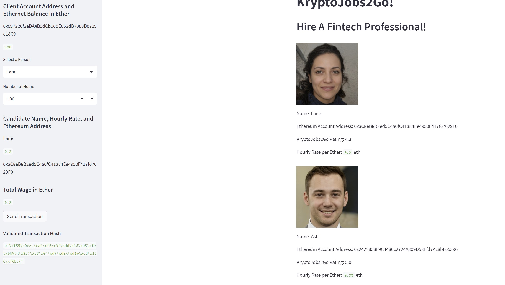
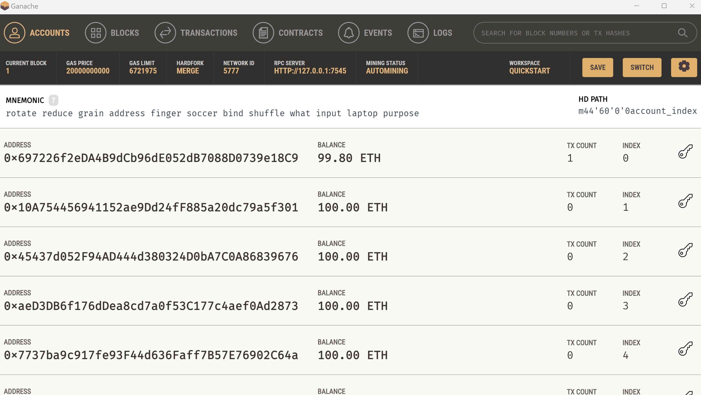
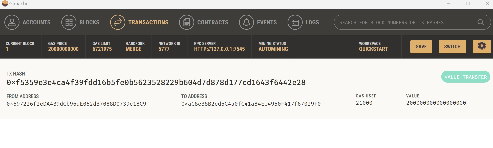

# Module 19 Blockchain Wallet

## Task

generating a digital wallet, accessing Ethereum account balances, and signing and sending transactions via a personal Ethereum blockchain called Ganache through Streamlit.

## Steps

- Create and review the functions that has been learned through the week; generate_account , get_balance , send_transaction.
- Import function in krypto_jobs.py and execute it 
- Modify the Streamlit interface
- Test out Streamlit by filling up boxes and sending transaction

## Result

- Select the person to hire and input number of hours and then the system will automatically calculate the wage from multiplication of hours and rate per hour

- Click transaction and baloons of confirmation will appear as well as validated transaction hash that can be found on bottom left

- As can be seen Ganache recorded the eth balance before and after the transaction.

- the proof of transaction also appeared in transaction section of Ganache
